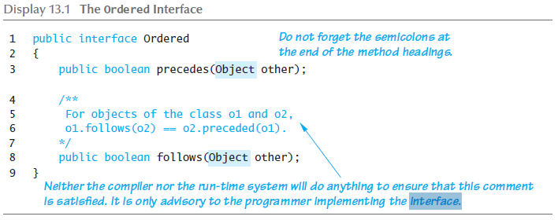

# Interfaces

 - A java *interface* specifies a set of methods that any class that implements the interface must have.
 - An interface is itself a type.
 - One way to view an interface is as an extreme form of an abstract class.
 - An interface is not a class. It is, however, a type that can be satisfied by any class that implements the interface.
 - An interface is a property of a class that says what methods it must have. (Es. topology)

 





# Interfaces nel Java Collection Framework


# Caso d'uso - Observer pattern - Listener - Programmazione orientata agli eventi


# Caso d'uso - JButton's ActionListener
``` java
import java.awt.*;
import java.awt.event.*;
import javax.swing.*;

public class JButtonListenerExample
{
  static JFrame frame;

  public static void main(String[] args)
  {
    // schedule this for the event dispatch thread (edt)
    SwingUtilities.invokeLater(new Runnable()
    {
      public void run()
      {
        displayJFrame();
      }
    });
  }

  static void displayJFrame()
  {
    frame = new JFrame("Our JButton listener example");

    // create our jbutton
    JButton showDialogButton = new JButton("Click Me");
    
    // add the listener to the jbutton to handle the "pressed" event
    showDialogButton.addActionListener(new ActionListener()
    {
      public void actionPerformed(ActionEvent e)
      {
        // display/center the jdialog when the button is pressed
        JDialog d = new JDialog(frame, "Hello", true);
        d.setLocationRelativeTo(frame);
        d.setVisible(true);
      }
    });

    // put the button on the frame
    frame.getContentPane().setLayout(new FlowLayout());
    frame.add(showDialogButton);

    // set up the jframe, then display it
    frame.setDefaultCloseOperation(WindowConstants.EXIT_ON_CLOSE);
    frame.setPreferredSize(new Dimension(300, 200));
    frame.pack();
    frame.setLocationRelativeTo(null);
    frame.setVisible(true);
  }
}
```


# Video approfondimenti

<iframe width="560" height="315" src="https://www.youtube.com/embed/f8vh966cOcw" frameborder="0" allow="accelerometer; autoplay; encrypted-media; gyroscope; picture-in-picture" allowfullscreen></iframe>


<iframe width="560" height="315" src="https://www.youtube.com/embed/1PPDoAKbaNA" frameborder="0" allow="accelerometer; autoplay; encrypted-media; gyroscope; picture-in-picture" allowfullscreen></iframe>