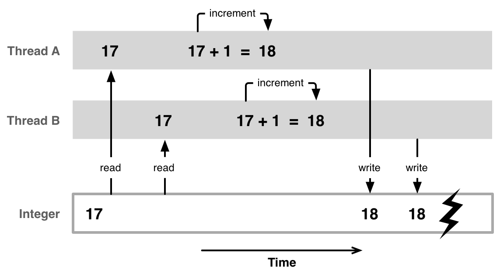

# Threads

## Link utili
 - [slide](http://www-lia.deis.unibo.it/Courses/CalcEle2/Threads.pdf)
 - [class thread](https://docs.oracle.com/javase/7/docs/api/java/lang/Thread.html)
 - [race condition - stackoverflow](https://stackoverflow.com/questions/25156724/code-to-simulate-race-condition-in-java-thread)
 - [race condition - blog post](http://opensourceforgeeks.blogspot.com/2014/01/race-condition-synchronization-atomic.html)
 
## Race condition problem

 